# Write-UP Rootme, TryHackme.

After running a ping and confirming connectivity, we launch an nmap scan and discover that ports 22 and 80 are open.

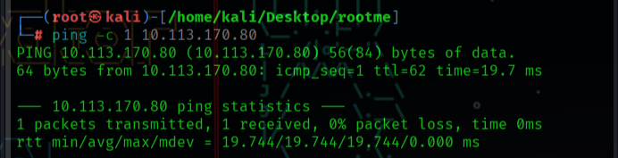
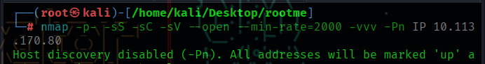

The first is port 22 with the SSH protocol, and port 80 is running an Apache 2.4.41 HTTP server. 

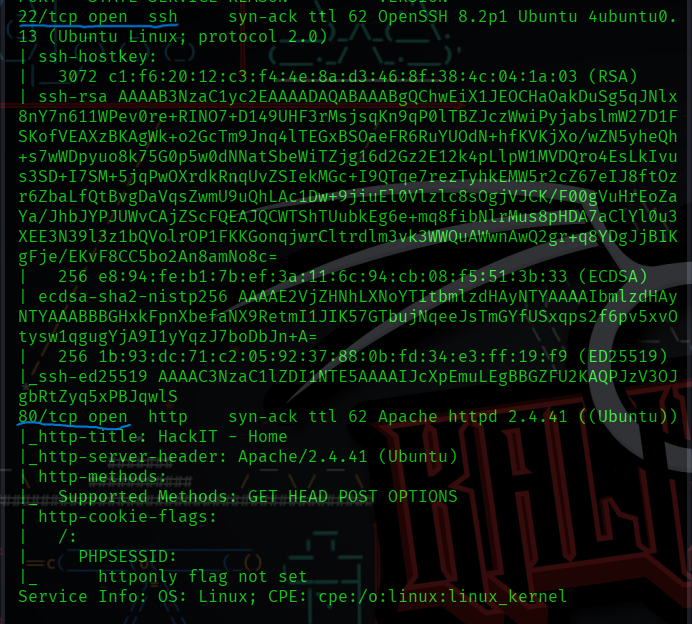

We already have the first three lab questions:

**Scan the machine, how many ports are open?**

Port 22 and port 80.

**What version of Apache is running?**

2.4.41

**What service is running on port 22?**

SSH

Next, we navigate to the webpage to see what we can find.

There is nothing interesting on the main page or in the source code.

We proceed to perform fuzzing with gobuster to enumerate directories.

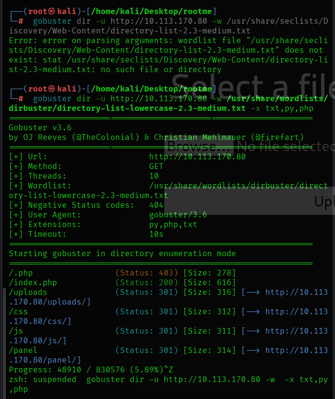

We start the scan and quickly find the first interesting directory: `uploads`. So we navigate to it. We see that files can be uploaded. Then we check the second interesting directory, `panel`, where we also find that we can upload files.

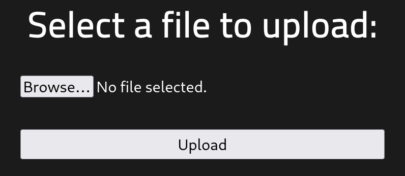

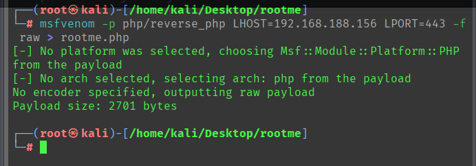

So we proceed to execute a payload. It does not allow us to upload it as a `.php` file, so we modify it to `.phtml`. Our payload is successfully uploaded.

We start listening on port 443, and once we open the payload from the uploads directory, we receive a connection.

Msfvenom payloads are often unstable, so we stabilize it using a reverse shell on port 444.

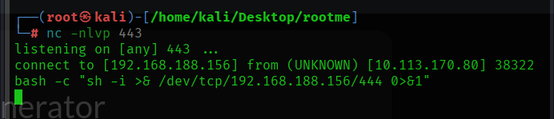

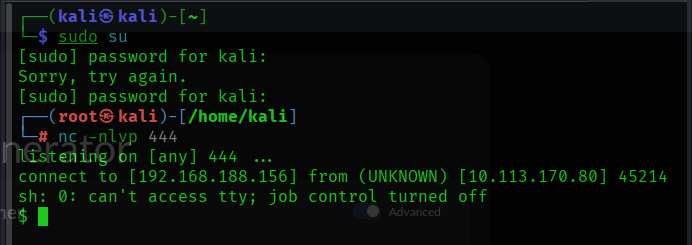

The reverse shell we paste into the netcat connection on port 443 was obtained from the website “reverse shells generator”.

Now we can answer the next lab question:

What is the hidden directory?

/panel

We now have a stabilized connection as the user `www-data`. We begin exploring the system to see what we can find. After listing directories, we notice that root privileges are required for most of them.

After a long search where we either find nothing or lack permissions, we navigate to the `/var/www` directory (very important to always check), where we find `user.txt`. We open it and obtain our first flag.

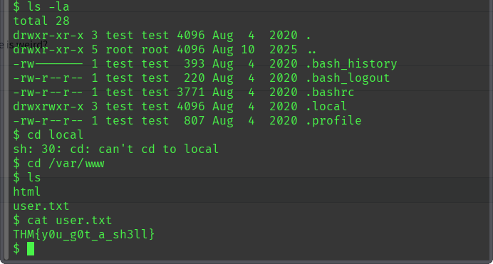

FLAG 1: THM{y0u_g0t_a_sh3ll}

Now it's time for privilege escalation. The lab hints that we should use SUID binaries. We run the command:

find / -perm -4000 2>/dev/null

to search for binaries that could be used for escalation.

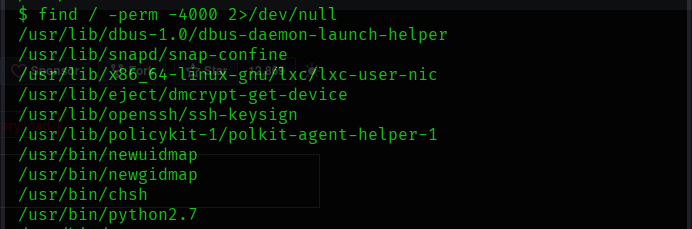

We notice the well-known `pkexec`, which has a famous vulnerability. However, the lab marks it as invalid when answering the question, so we continue investigating.

After checking other write-ups, we find that the lab expects us to use Python. In our case, it appears as `python2.7`.

We go to GTFOBins and search for Python. We find a method where, by executing:

python -c 'import os; os.execl("/bin/sh", "sh", "-p")’

We obtain root privileges.

 We then navigate through directories, list `/root`, and find the files containing the final flag.

Machine completed.

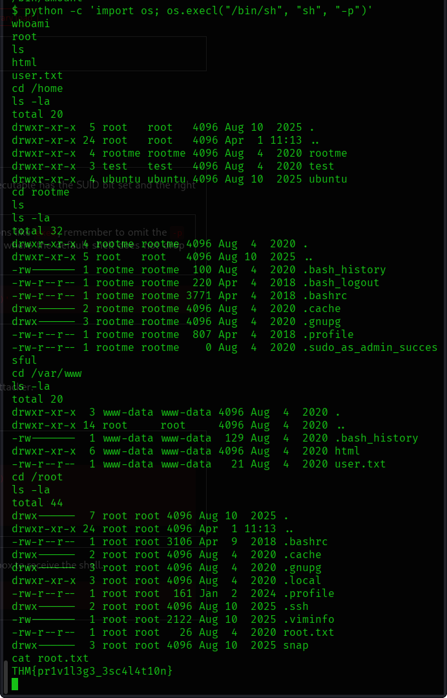